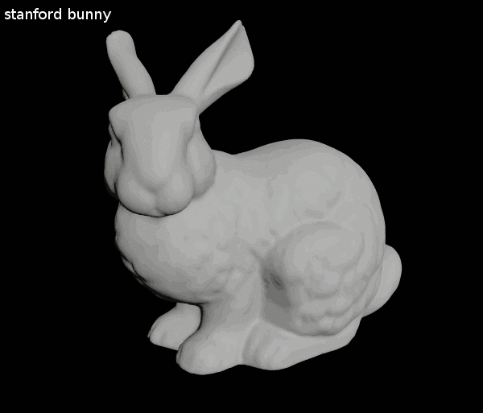

# kdtreePathTracerOptimization
KD tree optimization for path tracing

CIS565 Final Project Fall 2016 
Rony Edde

### K-D Tree optimizations for path tracer
Shooting rays through a complex scene with a large number of
polygons can be heavy and exponentially slow even on the GPU.  Axis
Aligned Bounding boxes help improve performance, however this still
doesn't solve the problem when rays intersect a complex object with
millions of triangles.

Using a K-D Tree to represent the triangles reduces the overall
complexity of the lookup and the time needed to find the
intersecting triangles.  There is a cost of computation for
generating the KD-Tree but in most cases the scene is mostly static
geometry which should benefit from this data structure.

 (image from wikipedia)

* Path tracing hurdles.
Complex geometry tends to take a lot of memory.  The current path
tracer is unable to load complex geometry and crashes when the limit
is reached.  GPUs don't have enough memory to compete with CPUs 
and a typical path tracer loading millions of triangles can easily crash
the graphics card.  Just accessing the entire geometry without an optimized data structure can be close to impossible without resorting to optimizations.  However, even after optimizations, this can remain a major issue with high risks of overwhelming the GPU memory and resulting in a crash.  To solve this, we must resort to streaming.  If the object loaded has 1 million triangles, it would require 192MB of GPU memory on a 64 bit machine.  In today's applications and games 1 million polygons is considered low resolution.  We can see how this quickly becomes an issue.

Streaming alone, however presents additional complexities for optimization.  KD-Trees will need to be adaptive and fast in order to account for this.  Another option is to split the complexity in sub-trees in order to fit in memory, thus reducing the impact caused by streaming. This could have an impact on the benefit of using KD-Trees and can also present issues when rendering double sided geometry.

* Initial tentative road map
The project will consist of coming up with and implementing a K-D Tree that solves these issues with CPU and GPU generation.

* KD-tree implementation progress 1
Currently building the main KD-Tree library in rnd as a stand alone library.  The current implamentation uses the following data astructures.
  * Triangle:  
  This hold the data what will represent the mesh triangles in the path tracer.  The path tracer will have to adapted in order to pass in triangle data instead of the usual point positions.
  The Triangle contains centroid information as well as bounds, the is needed for leaf nodes.  Centroid information may be discarded in the future.
  * BoundingBox:  
  This contains bounding information as well as a helper to compute bounds and centroids for triangles.  This does not contain any triangle information as it is not necessary for intermediate nodes.
  * KDnode:  
  This is where all the logic resides.  Currently the building and accessing of the tree is possible.
    * The core implementation functions not including trivial helpers:
      * split(): splits the tree with the specified depth. This is useful for limiting the number of level to avoid going as far as a leaf per triangle as this may not be the most efficient configuration.
      * updateBbox() and mergeBbox() for adding triangles and updating the node bounds when merging with other boundingboxes.
      * deleteTree() for clean memory management.
      * printTree(), printTriangleCenters() for printing the tree contents as a sanity check.
      * getDepth(), getLevel() for checking node level and the depth from a node to a leaf.

  * This setup is being tested with a custom SideFX Houdini binding for verifying and validating the results.  This binding saves the triangles of any object from Houdini to a file.  The file is then read by the KD-Tree class which splits the data and writes out the tree to a file.  The generated file is then read in Houdini where the bounding hierarchy is displayed using a custom library build as a Houdini Python SOP node.

  * Houdini visualization network.
  

  * Bugs are not trivial to track down.  At first the tree was going deeper than expected with duplication along the way.  This is easy to see now that the setup is in place.  This makes degugging a lot easier The initial results look promising.
  
  

  * Result of a one branch traversal seem to be working correctly.
  

  * Next milestone will be to generate and traverse the tree using loops.  Removing all recursion is not trivial, nor is it cleaner but it's necessary for CUDA because of the lack of recusrion and the non dynamic memory allocation needed for optimization.

